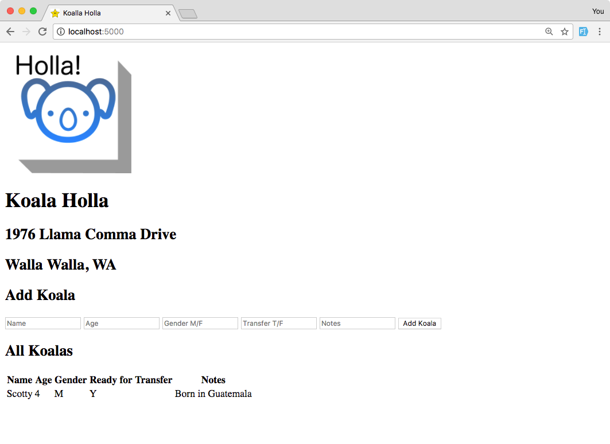

# Koalla Holla
This project was an assignment at Prime. It's a CRUD app using jQuery and PostgreSQL. User can add a Koalla with a name, age, gender, transfer status, and a note to a local database.

<p>
    
</p>

## Technology Used
jQuery, SQL, JavaScript, HTML, CSS.

## Getting started

### Requirements
Postico, Node.JS.

### Installing
* Create table using database.sql file in Postico. 
* Run ```npm install``` in terminal.

## Current Features
* User can add a koalla.

## Features to add
* User receives feedback for incorrect text input.
* User can edit koalla information.
* User can delete a koalla.
* User can mark koalla as ready-for-transfer after adding.